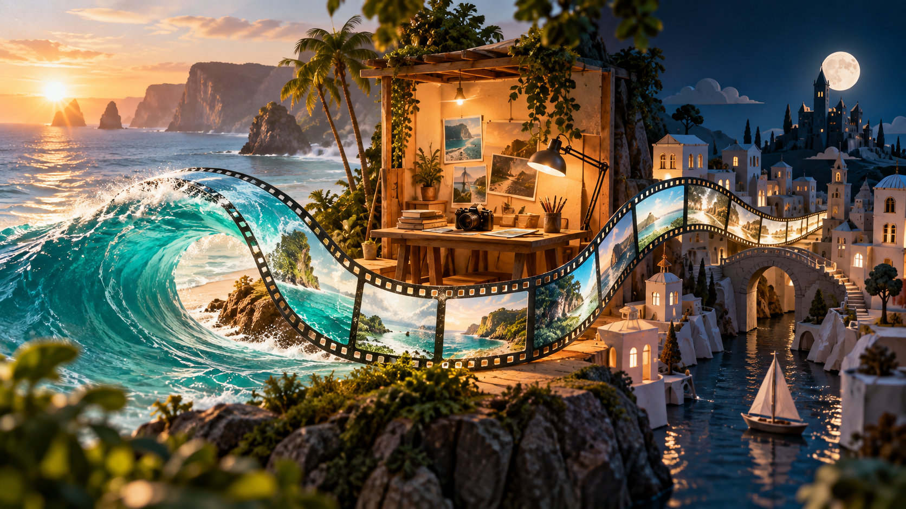
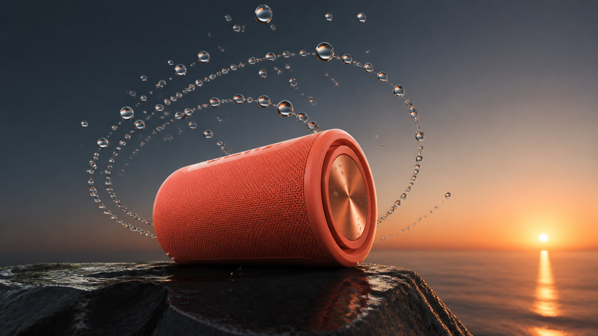
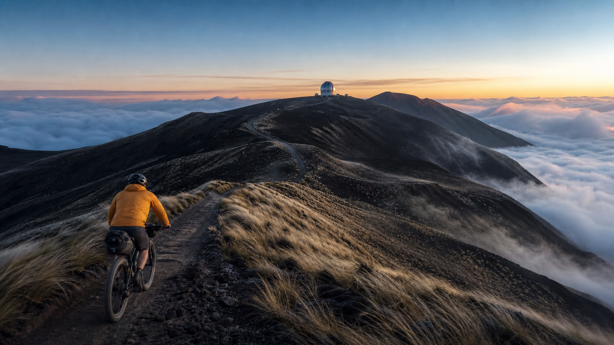
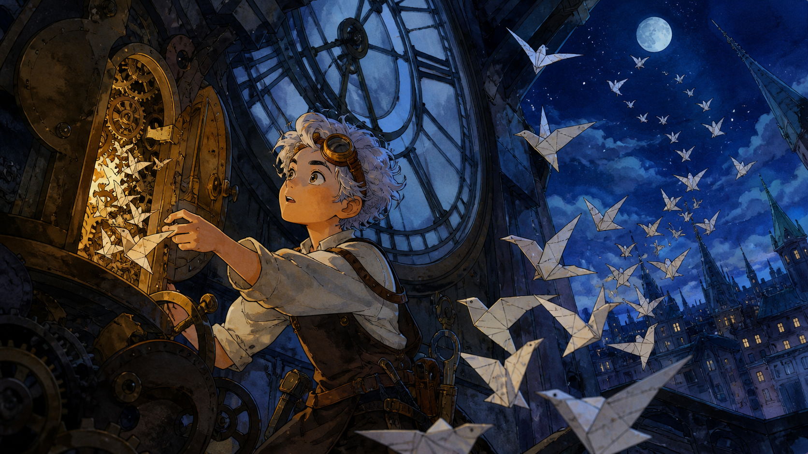

# Kumpulan prompt video Gemini Omni untuk SeaImagine

[English](README.md) · [简体中文](README_ZH.md) · [繁體中文](README_ZH-TW.md) · [日本語](README_JA.md) · [한국어](README_KO.md) · [Español](README_ES.md) · [Français](README_FR.md) · [Deutsch](README_DE.md) · [Português](README_PT.md) · [Italiano](README_IT.md) · [Русский](README_RU.md) · [Bahasa Indonesia](README_ID.md) · [ไทย](README_TH.md) · [Tiếng Việt](README_VI.md) · [العربية](README_AR.md)



60 prompt diadaptasi dari repositori Flaq AI untuk pengguna SeaImagine: iklan produk, perjalanan, animasi, dan penyuntingan. Tiga contoh berikut menyertakan gambar referensi dan prompt lengkap berbahasa Inggris.

[Gemini Omni](https://seaimagine.com/id/model/gemini-omni/) · [Gemini Omni 1.1 Flash](https://seaimagine.com/id/model/gemini-omni-1-1-flash/)

## Mulai dengan SeaImagine

1. Buka halaman model dan periksa akses, harga, serta pengaturan yang tersedia.
2. Untuk menjaga tampilan produk atau karakter, pilih gambar ke video, unggah satu gambar, lalu tempel prompt yang sesuai. Untuk adegan baru, coba teks ke video.
3. Pilih durasi dan format pada antarmuka. Uji satu adegan, periksa tampilan, gerakan, dan suara, lalu ubah satu instruksi setiap kali.

Ini rancangan prompt, bukan hasil generasi yang telah diuji di SeaImagine. Durasi, audio, penyuntingan, perpanjangan, dan referensi bergantung pada model serta antarmuka saat ini. Fitur API Google tidak otomatis tersedia di SeaImagine.

## Tiga prompt untuk disalin

Gambar ini adalah referensi bingkai awal dari repositori sumber, bukan hasil video. Unggah gambar yang sesuai sebagai Image1. Durasi 10 detik dan audio adalah sasaran; sesuaikan dengan pengaturan yang tersedia.

### 01 · Speaker produk: irama tetesan air



```text
Create a 10-second premium product film from Image1. Use Image1 as the exact starting frame.

[0-3s] Make a slow 20-degree clockwise camera orbit. Suspended droplets travel around the speaker in clean concentric paths, aligned to a deep electronic kick. Preserve the speaker's exact coral color, grille weave and proportions.
[3-7s] A sunrise reflection sweeps across the copper end cap. On the snare, droplets strike the wet stone and rebound as fine mist.
[7-10s] All droplets collapse into one crisp splash behind the product, then settle on a steady three-quarter hero frame with negative space on the right.

Audio: original minimal electronic rhythm at 96 BPM, water-drop percussion, distant ocean ambience. No vocals.
No product morphing, added controls, text, logo, watermark, hands, duplicate product or camera shake.
```

### 02 · Bersepeda di punggung bukit: pembuka dokumenter



```text
Animate Image1 as a single continuous 10-second documentary tracking shot. Use it as the exact first frame.

The cyclist pedals steadily toward the observatory while the camera follows from the same height. Silver grass bends in two wind gusts, loose gravel reacts under the rear tire, and clouds move slowly below the ridge. At 6s, the first warm sunlight reaches the jacket and observatory dome.

Audio: close tire crunch and chain movement, strong ridge wind, one distant bird at 7s. No music or narration.
No cuts, drone rise, extra cyclists, landmark text, logo or watermark.
```

### 03 · Pembuat jam dan burung kertas: kisah ilustrasi



```text
Bring this illustration to life in one coherent 10-second animated shot. Use Image1 as the first frame and preserve its watercolor-and-ink direction.

[0-3s] The brass door clicks open and warm light grows inside it. Nearby gears rotate at different believable speeds.
[3-7s] Paper birds unfold one by one and spiral past the camera with visible paper flex. Tilt upward to follow them through the clock opening.
[7-10s] The flock crosses the moon; one tiny paper bird lands on the clock hand.

Audio: layered clock ticks, delicate paper folds, wooden gear creaks, then an original celesta motif. No dialogue.
Keep the clockmaker's face, clothes and goggles consistent. No photorealism, subtitles, logo or watermark.
```

## Semua 60 prompt

Lima koleksi pertama memiliki penjelasan berbahasa Mandarin, dua terakhir berbahasa Inggris. Semua prompt kontrol menggunakan bahasa Inggris. Isi koleksi belum diterjemahkan seluruhnya.

- [Film dan penceritaan: 8 prompt](prompts/cinematic-storytelling.md)
- [Iklan dan media sosial: 8 prompt](prompts/commerce-social.md)
- [Dokumenter, perjalanan, dan pendidikan: 8 prompt](prompts/documentary-education.md)
- [Animasi, musik, dan hiburan: 8 prompt](prompts/stylized-entertainment.md)
- [Kontrol, penyuntingan, dan perpanjangan: 10 resep](prompts/control-editing-extension.md)
- [Penyuntingan lanjutan, kamera, dan transformasi visual: 9 prompt](prompts/advanced-editing-camera.md)
- [Storyboard, layar terbagi, teks, dan evaluasi: 9 prompt](prompts/storyboard-text-evaluation.md)

## Dialog dalam bahasa Indonesia

Jika perlu, pertahankan instruksi adegan dalam bahasa Inggris dan tentukan dialog serta teks layar dalam bahasa Indonesia secara persis. Periksa pelafalan, ejaan, dan waktu.

```text
Spoken language: Indonesian.
Exact dialogue at 6s, spoken once with natural conversational pacing: "Hari ini, mari kita pulang lewat jalan yang lebih panjang."
Do not translate, paraphrase, repeat or subtitle it.

Exact on-screen Indonesian title: "PERJALANAN KECIL"
Preserve spelling exactly. No other text.
```

## Bacaan lanjutan

- [Alur kerja SeaImagine](docs/seaimagine-workflow.md)
- [Contoh resmi dan komunitas](docs/community-examples.md)
- [Panduan multibahasa](docs/multilingual-guide.md)
- [Perancangan prompt](docs/prompting-guide.md)
- [Referensi dan izin](docs/reference-videos.md)

## Alat SeaImagine lainnya

Gunakan halaman ini sebagai pilihan awal lainnya. Periksa model, ketentuan, dan harga terkini pada setiap halaman. Repositori ini tidak menjamin ketersediaan tanpa henti.

- [Buat](https://seaimagine.com/id/create/)
- [Gambar ke video](https://seaimagine.com/id/image-to-video/)
- [Teks ke video](https://seaimagine.com/id/text-to-video/)
- [Generator gambar AI](https://seaimagine.com/id/ai-image-generator/)

## Sumber dan lisensi

Diadaptasi dari repositori Flaq AI, termasuk kumpulan prompt dan tiga gambar referensi. Tidak semua materi merupakan karya asli SeaImagine. Panduan independen, bukan produk resmi Google.

[Flaq AI · awesome-gemini-omni-flash](https://github.com/flaqai/awesome-gemini-omni-flash) · [MIT](LICENSE)
