<div align="center">


# Raccolta di prompt per Gemini Omni

**76 prompt completi in 9 categorie, 6 esempi con fotogrammi iniziali originali e risultati accompagnati dai prompt pubblicati dagli autori.**

[English](README.md) · [简体中文](README_ZH.md) · [繁體中文](README_ZH-TW.md) · [日本語](README_JA.md) · [한국어](README_KO.md) · [Español](README_ES.md) · [Français](README_FR.md) · [Deutsch](README_DE.md) · [Português](README_PT.md) · [Italiano](README_IT.md)

[Русский](README_RU.md) · [Bahasa Indonesia](README_ID.md) · [ไทย](README_TH.md) · [Tiếng Việt](README_VI.md) · [العربية](README_AR.md)

[Sfoglia per categoria](#prompt-collections) · [Sei esempi pronti da copiare](#source-examples) · [Risultati ufficiali e della community](#video-studies) · [Indice di tutti i 76 prompt](docs/prompt-index.md) · [Scarica tutti i prompt in formato testo](prompts/copy/all-prompts.txt)

</div>

<a id="prompt-collections"></a>

## Sfoglia per categoria

<table width="100%">
<tr>
<td width="33%" align="center" valign="top"><strong><a href="prompts/cinematic-storytelling.md">Cinema e narrazione</a></strong><br><br><a href="prompts/cinematic-storytelling.md">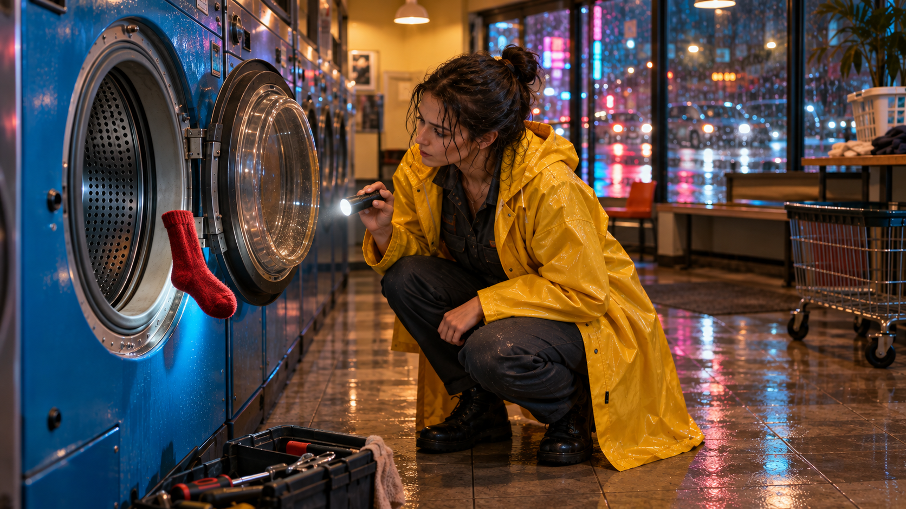</a><br>8 prompt<br><a href="prompts/cinematic-storytelling.md#case-index">Visualizza</a></td>
<td width="33%" align="center" valign="top"><strong><a href="prompts/commerce-social.md">Pubblicità e social media</a></strong><br><br><a href="prompts/commerce-social.md"></a><br>8 prompt<br><a href="prompts/commerce-social.md#case-index">Visualizza</a></td>
<td width="33%" align="center" valign="top"><strong><a href="prompts/documentary-education.md">Documentario, viaggio e istruzione</a></strong><br><br><a href="prompts/documentary-education.md">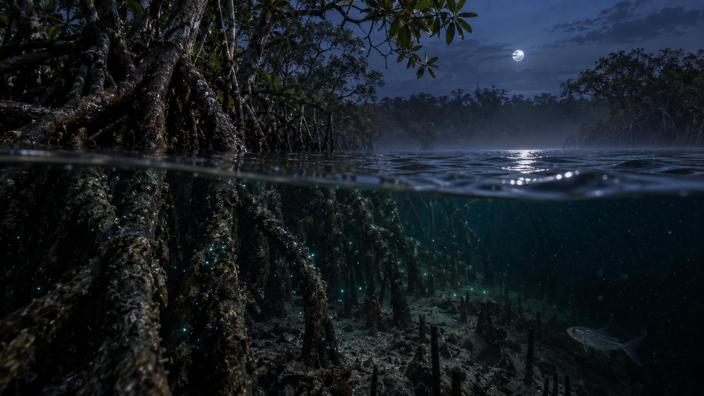</a><br>8 prompt<br><a href="prompts/documentary-education.md#case-index">Visualizza</a></td>
</tr>
<tr>
<td width="33%" align="center" valign="top"><strong><a href="prompts/stylized-entertainment.md">Animazione, musica e intrattenimento</a></strong><br><br><a href="prompts/stylized-entertainment.md">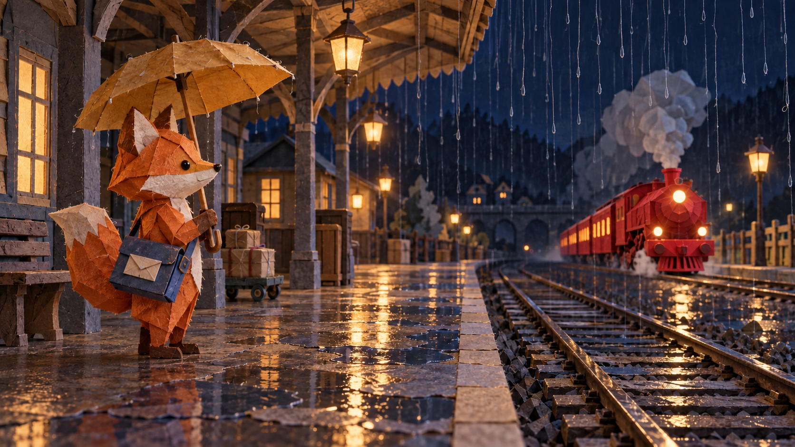</a><br>8 prompt<br><a href="prompts/stylized-entertainment.md#case-index">Visualizza</a></td>
<td width="33%" align="center" valign="top"><strong><a href="prompts/control-editing-extension.md">Controllo multimodale, modifica ed estensione</a></strong><br><br><a href="prompts/control-editing-extension.md">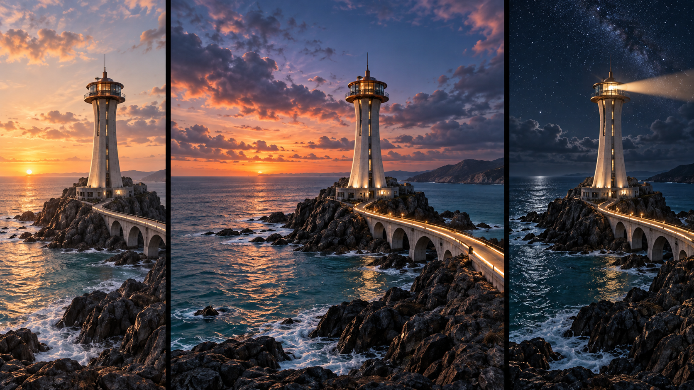</a><br>10 prompt<br><a href="prompts/control-editing-extension.md#case-index">Visualizza</a></td>
<td width="33%" align="center" valign="top"><strong><a href="prompts/advanced-editing-camera.md">Modifica avanzata, camera e trasformazioni</a></strong><br><br><a href="prompts/advanced-editing-camera.md">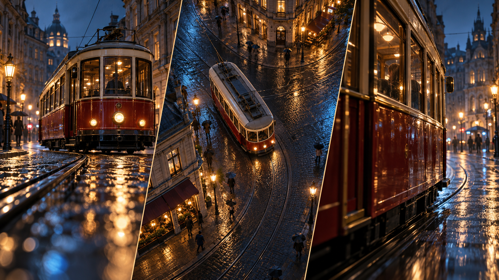</a><br>9 prompt<br><a href="prompts/advanced-editing-camera.md#case-index">Visualizza</a></td>
</tr>
<tr>
<td width="33%" align="center" valign="top"><strong><a href="prompts/storyboard-text-evaluation.md">Storyboard, testo e valutazione</a></strong><br><br><a href="prompts/storyboard-text-evaluation.md">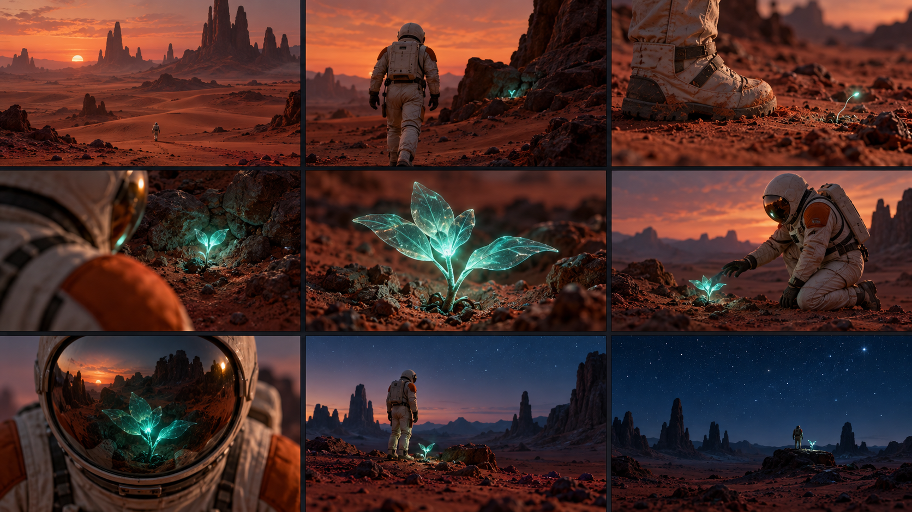</a><br>9 prompt<br><a href="prompts/storyboard-text-evaluation.md#case-index">Visualizza</a></td>
<td width="33%" align="center" valign="top"><strong><a href="prompts/tactile-asmr.md">Materiali e ASMR</a></strong><br><br><a href="prompts/tactile-asmr.md">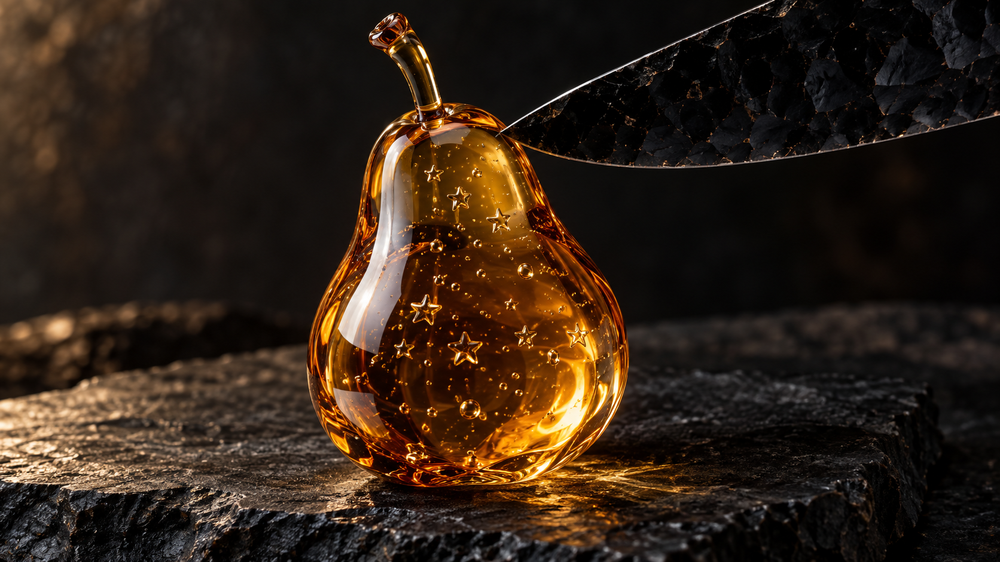</a><br>8 prompt<br><a href="prompts/tactile-asmr.md#case-index">Visualizza</a></td>
<td width="33%" align="center" valign="top"><strong><a href="prompts/miniature-worlds.md">Mondi in miniatura e immaginari</a></strong><br><br><a href="prompts/miniature-worlds.md">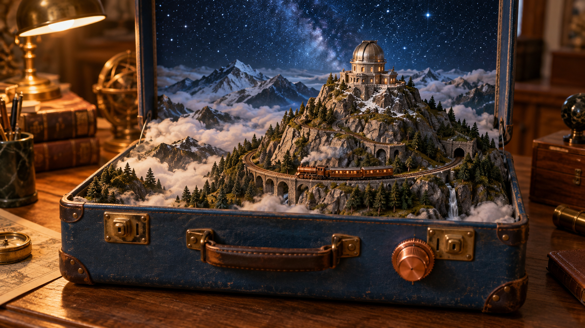</a><br>8 prompt<br><a href="prompts/miniature-worlds.md#case-index">Visualizza</a></td>
</tr>
</table>

Le immagini delle categorie ne illustrano i temi. Le sei immagini di esempio sono fotogrammi iniziali di riferimento. Nessuna rappresenta un risultato video generato.

[Indice di tutti i 76 prompt](docs/prompt-index.md) · [Scarica tutti i prompt in formato testo](prompts/copy/all-prompts.txt) · [Fonti di ispirazione per le nuove categorie](docs/public-prompt-sources.md#category-inspiration)

Le descrizioni delle categorie sono in cinese e inglese; tutti i prompt completi da copiare sono in inglese.

<a id="source-examples"></a>

## Sei esempi pronti da copiare

Le immagini di riferimento sono materiale di input, non risultati generati.

[01 · La lavanderia dimentica la gravità](#example-01) · [02 · Profumo ambrato ed eclissi meccanica](#example-02) · [03 · Sotto l’acqua delle mangrovie](#example-03) · [04 · La volpe consegna l’ultima lettera](#example-04) · [05 · Pera di vetro ambrato con cuore stellato](#example-05) · [06 · Un osservatorio dentro una valigia](#example-06)

<a id="example-01"></a>

### 01 · La lavanderia dimentica la gravità

[](assets/showcase-v2-01.png)

[Cinema e narrazione](prompts/cinematic-storytelling.md) · [Primo fotogramma di riferimento](assets/showcase-v2-01.png) · [Testo semplice](prompts/copy/showcase-v2-01.txt)

```text
Use Image1 as the exact first frame of a 10-second, 16:9 cinematic shot. One adult repair technician in a yellow raincoat crouches beside one open cobalt-blue washing machine. A single red sock already floats just above the lower drum rim. Keep the washer, doorway and puddle layout fixed. Preserve the technician's appearance and the red sock's identity while allowing the specified movements.

[0-3s] Begin a slow, level camera push toward the open drum. The red sock rises another twenty centimetres and gently rotates. The technician notices it, steadies the small flashlight in her right hand, then looks from the sock to the puddle below. Her face shows curiosity rather than panic. Rain continues downward outside.
[3-7s] Gravity reverses only inside a cylinder extending vertically from the washer opening. A narrow stream lifts from the puddle directly beneath it into floating beads. The woman raises her empty left palm beneath the sock without touching it. Her raincoat, hair and tools remain normally weighted. Keep the washer firmly on the floor; do not rotate the room or the horizon.
[7-10s] The machine emits one soft relay click. The beads fall back into the original puddle; the sock drops neatly into her waiting left palm. Stop the camera movement as she gives the empty drum a small, incredulous glance.

Audio: continuous rain behind glass, a low motor winding down, individual water beads landing, then the relay click. No score or dialogue. Maintain a single continuous shot, natural hands, one sock and one technician. No extra laundry, text, logos, jump cuts or spontaneous object duplication. The final pose must visibly follow the catch.
```

<a id="example-02"></a>

### 02 · Profumo ambrato ed eclissi meccanica

[](assets/showcase-v2-02.png)

[Pubblicità e social media](prompts/commerce-social.md) · [Primo fotogramma di riferimento](assets/showcase-v2-02.png) · [Testo semplice](prompts/copy/showcase-v2-02.txt)

```text
Animate Image1 into a 10-second, 16:9 product film in one continuous macro shot. The unlabelled square glass bottle contains amber perfume and remains upright on the same dark stone surface. Preserve the flat faces, straight edges, copper cap, fill level and bottle proportions. The copper gear ring moves behind it; one thin semicircular orange slice is fixed to the upper ring.

[0-3s] Move the camera slowly ten centimetres to the right while keeping the bottle dominant in the left half of the frame. A narrow amber light travels across the front glass, revealing fine condensation and the thickness of its base. The copper ring begins a steady clockwise turn around its visible pivot. The orange slice travels with that ring as one attached object, never independently.
[3-7s] The slice passes in front of the backlight, creating a partial eclipse. Its translucent pulp projects a moving citrus-coloured pattern through the bottle onto the stone surface. Keep the bottle stationary while the background mechanism creates the movement. Focus shifts briefly from the bottle's front edge to the illuminated pulp, then returns smoothly to the bottle.
[7-10s] The ring finishes a half revolution. The orange slice clears the light, revealing a clean bright crescent behind the upper-right bottle corner. Ease both camera and mechanism to a stop on a readable three-quarter product view with the bottle and mechanism both remaining visible.

Audio: one quiet copper bearing tick, a restrained original three-note plucked motif, and a soft mechanical stop. No pouring or fizzing sounds. No label, typography, brand mark, extra bottles, spraying perfume, melting glass, changing liquid level or cuts. The copper supports must remain physically attached and visible.
```

<a id="example-03"></a>

### 03 · Sotto l’acqua delle mangrovie

[](assets/showcase-v2-03.png)

[Documentario, viaggio e istruzione](prompts/documentary-education.md) · [Primo fotogramma di riferimento](assets/showcase-v2-03.png) · [Testo semplice](prompts/copy/showcase-v2-03.txt)

```text
Use Image1 as the starting frame for a 10-second, 16:9 natural-history-style visual study. This is an imaginative night scene, not a claim about a particular filmed species or location. Begin with the lens half above and half below calm mangrove water. Preserve the branching root geometry. The small silver fish begins at lower right and follows the path specified below. Sparse blue-green points are already visible near submerged roots.

[0-3s] Drift forward at a slow swimmer's pace. Above water, one leaf releases a droplet; the resulting ring spreads across the surface. Below water, suspended particles drift with the current. Keep a physically coherent waterline, with refraction and slight distortion separating the two views.
[3-6s] Lower the camera smoothly until the lens is fully submerged. Let the surface slide upward out of frame instead of dissolving between scenes. Follow the original silver fish as it turns left between two roots. A brief, localized trail of blue-green light responds to its wake and fades behind it; do not illuminate every root or particle.
[6-10s] Advance beneath the root arch and stop gently. The fish leaves through the left edge. Residual points fade to reveal amber silt and root textures in the low light. End looking back toward a narrow reflection of the night sky on the underside of the surface.

Audio: insects and distant water movement above the surface, transitioning continuously to muted underwater movement during submersion. No music, narration, dolphin calls or theatrical sonar. No people, added animals, coral, floating text, glowing plant outlines, abrupt lighting changes or cuts. Maintain plausible water movement and the same small fish throughout.
```

<a id="example-04"></a>

### 04 · La volpe consegna l’ultima lettera

[](assets/showcase-v2-04.png)

[Animazione, musica e intrattenimento](prompts/stylized-entertainment.md) · [Primo fotogramma di riferimento](assets/showcase-v2-04.png) · [Testo semplice](prompts/copy/showcase-v2-04.txt)

```text
Animate Image1 as a 10-second, 16:9 handmade paper stop-motion scene. An orange origami fox mail carrier stands at the left of a tiny railway platform under an ochre folded-paper umbrella, carrying an indigo paper satchel. One red folded-paper train approaches from the right background. Preserve every major fold, the fox's triangular muzzle, its two ears, the satchel strap and the station's paper construction.

[0-3s] The train rolls toward the platform in small, deliberate stop-motion increments. Fine suspended strands and tiny droplets suggest rain beyond the canopy; preserve the handmade set and folded-paper surfaces. Warm lanterns move slightly on thread-like supports. The fox turns its head toward the train while keeping the umbrella in the same paw.
[3-6s] The train stops with its nearest window aligned beside the fox. With its free paw, the fox extracts the single plain cream envelope already visible in the satchel front pocket. The pocket opens along its existing paper fold. Keep the envelope visibly separate from the paw and bag throughout.
[6-10s] The fox slides the envelope through the open train window onto a visible empty ledge; no passenger is needed. It withdraws its paw, gives one small bow and smooths the satchel pocket. Finish with the train still stopped and the cream envelope visible inside. Move the camera only in a slow, shallow push; do not cut.

Audio: miniature wheel clicks, a quiet brake squeak, dry paper rustles and soft rain-like pattering. No voices or recognizable tune. Use a gently stepped animation cadence, visible paper grain and warm practical lighting. No written addresses, station signs, logos, flesh, extra paws, transforming folds or realistic fur.
```

<a id="example-05"></a>

### 05 · Pera di vetro ambrato con cuore stellato

[](assets/showcase-v2-05.png)

[Materiali e ASMR](prompts/tactile-asmr.md) · [Primo fotogramma di riferimento](assets/showcase-v2-05.png) · [Testo semplice](prompts/copy/showcase-v2-05.txt)

```text
Use Image1 as the exact opening of a 10-second, 16:9 macro material study. A transparent amber glass pear stands upright on charcoal slate. An obsidian blade enters from the upper right and just touches the unbroken surface. Several small star-shaped inclusions are visible within the core. Treat the pear as a deliberately imaginary, sliceable glass material; it is not real fruit or a real cutting demonstration.

[0-3s] Hold the camera steady at the original low three-quarter angle. The blade presses downward through the near-right side at a slow, even speed. A fine luminous seam follows the cutting edge. The pear stays anchored by its own weight; its stem and silhouette remain unchanged. Keep the blade rigid and show its edge penetrating the material rather than passing through invisibly.
[3-7s] Complete one continuous cut that separates a single thin outer slice. The slice leans away and settles on the slate at the right, exposing a flat translucent cross-section. The existing star-shaped inclusions remain embedded in the larger standing piece, with their arrangement unchanged and clearer through the cut face. Preserve the removed slice's curved outer skin and matching flat inner face.
[7-10s] Withdraw the blade upward along its entry path. Rack focus gently from the resting slice to the largest central star-shaped inclusion. Amber caustics brighten beneath the cut face and settle. End with exactly two pear pieces, one whole stem and an unobstructed view of the central inclusion.

Audio: close dry glass-like ticks during penetration, one delicate chime as the slice meets slate, then quiet room tone. No music, chewing, wet flesh sounds or exaggerated shattering. No hands, blood, sparks, loose shards, extra cuts, regenerated pear sections, camera orbit or text.
```

<a id="example-06"></a>

### 06 · Un osservatorio dentro una valigia

[](assets/showcase-v2-06.png)

[Mondi in miniatura e immaginari](prompts/miniature-worlds.md) · [Primo fotogramma di riferimento](assets/showcase-v2-06.png) · [Testo semplice](prompts/copy/showcase-v2-06.txt)

```text
Animate Image1 into a continuous 10-second, 16:9 miniature-diorama film. Inside an open blue hard-shell suitcase, a rocky mountain supports a brass-domed observatory above a shallow sea of clouds. One tiny steam locomotive with two carriages rests on a circular track around the mountain. A copper control knob sits on the front-right exterior panel. No hand is visible in the opening frame.

[0-2s] One adult hand enters from the near frame edge, reaches the copper knob on the front-right exterior panel, turns it one quarter-turn clockwise and releases it. The hand withdraws through the nearest frame edge without entering the miniature landscape. The suitcase, hinges, mountain and rails remain stationary. A tiny warm lamp beside the observatory door comes on.
[2-6s] The train starts gently and travels clockwise along the existing rails. Its three vehicles stay coupled, with wheels contacting the track. A narrow puff of steam rises from the locomotive and disperses above the carriage roofs. Slowly push the camera toward the mountain while keeping both suitcase rims visible to preserve the scale contrast.
[6-10s] The observatory dome rotates a small distance and its slit opens to reveal a short telescope aimed at one fixed star in the existing night sky. Clouds drift around the mountain base without spilling over the suitcase rim. Let the train continue behind the mountain, partially occluded rather than disappearing. Stop the camera with the glowing observatory above the cloud line.

Audio: close copper-knob click, miniature rail rhythm, soft gear movement and a restrained airy room ambience. No full-size train horn, narration or music. Preserve scale and object counts. No extra hands, flying rails, expanding suitcase, text, logos, time-lapse sky or cuts.
```

<a id="video-studies"></a>

## Risultati ufficiali e della community

Ogni risultato rimanda al prompt originale. I testi di X sono stati verificati tramite un mirror, senza controllare la riproduzione su X. Per la versione del modello consulta la fonte; il repository non ha riprodotto questi risultati.

<table width="100%">
<tr>
<td width="50%" valign="top"><strong>Scultura di bolle</strong><br><a href="https://storage.googleapis.com/gweb-uniblog-publish-prod/original_videos/rt_wm__omni__keynote__orb-structural-foam__260517_1.mp4">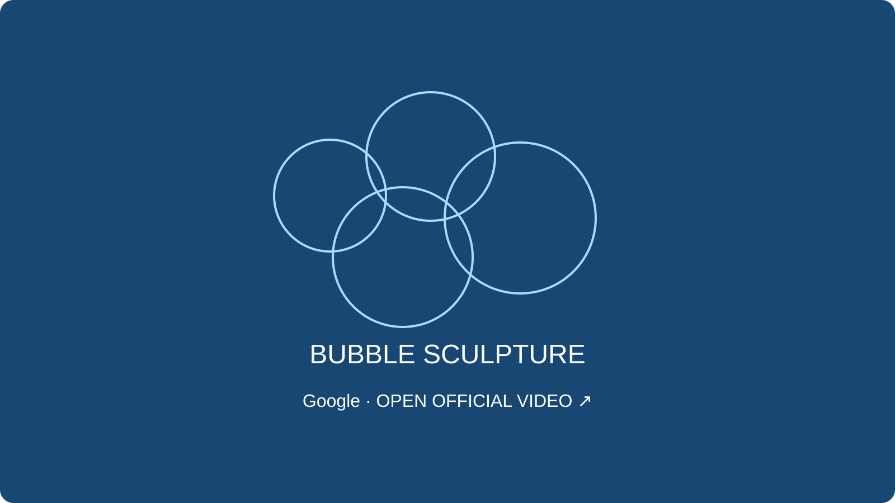</a><br>Google · Omni / Flash · 2026-05<br>Video in ingresso richiesto<br><strong>Estratto del prompt pubblicato</strong><blockquote>Make the sculpture out of bubbles.</blockquote><a href="https://blog.google/innovation-and-ai/models-and-research/gemini-models/gemini-omni-3-5-videos/">Prompt pubblicato dall’autore</a> · <a href="https://storage.googleapis.com/gweb-uniblog-publish-prod/original_videos/rt_wm__omni__keynote__orb-structural-foam__260517_1.mp4">Guarda il video</a> · <a href="https://blog.google/innovation-and-ai/models-and-research/gemini-models/gemini-omni-3-5-videos/">Fonte</a></td>
<td width="50%" valign="top"><strong>Una stanza dentro una sfera di vetro</strong><br><a href="https://storage.googleapis.com/gweb-uniblog-publish-prod/original_videos/rt_wm_omni__keynote__sizzle__hand-infinite-orbs__260517_1.mp4">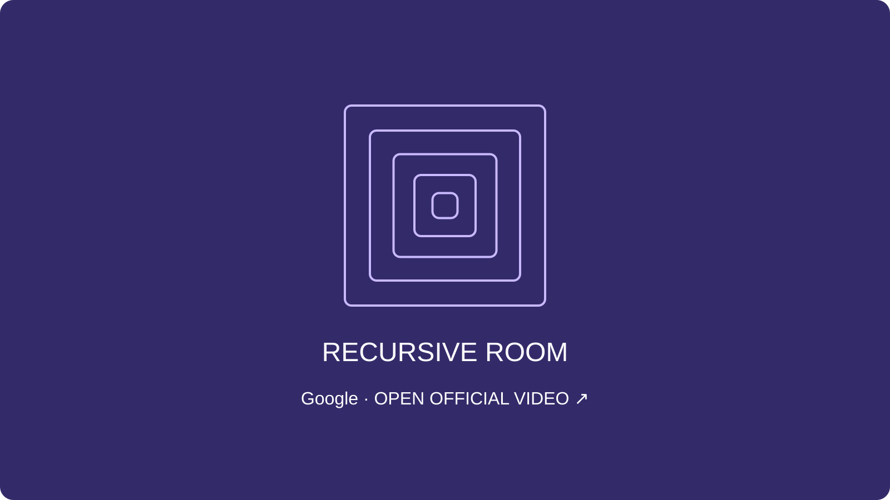</a><br>Google · Omni / Flash · 2026-05<br>Video in ingresso richiesto<br><strong>Estratto del prompt pubblicato</strong><blockquote>Put a black and white checkerboard room inside a glass sphere</blockquote><a href="https://blog.google/innovation-and-ai/models-and-research/gemini-models/gemini-omni-3-5-videos/">Prompt pubblicato dall’autore</a> · <a href="https://storage.googleapis.com/gweb-uniblog-publish-prod/original_videos/rt_wm_omni__keynote__sizzle__hand-infinite-orbs__260517_1.mp4">Guarda il video</a> · <a href="https://blog.google/innovation-and-ai/models-and-research/gemini-models/gemini-omni-3-5-videos/">Fonte</a></td>
</tr>
<tr>
<td width="50%" valign="top"><strong>Trasformare le persone in fenicotteri</strong><br><a href="https://video.twimg.com/amplify_video/2056797343085969408/vid/avc1/1080x1440/UYr_7RKomiginRgq.mp4?tag=27"></a><br>CHRIS FIRST · Omni / Flash · 2026-05<br>Video in ingresso richiesto<br><strong>Estratto del prompt pubblicato</strong><blockquote>Make everyone in this shot flamingos. Wearing the same outfit.</blockquote><a href="https://x.com/chrisfirst/status/2056797606509158681">Prompt pubblicato dall’autore</a> · <a href="https://video.twimg.com/amplify_video/2056797343085969408/vid/avc1/1080x1440/UYr_7RKomiginRgq.mp4?tag=27">Guarda il video</a> · <a href="https://x.com/chrisfirst/status/2056797606509158681">Fonte</a></td>
<td width="50%" valign="top"><strong>Cambiare cappello a ogni battito di mani</strong><br><a href="https://video.twimg.com/amplify_video/2056793760273686528/vid/avc1/720x1280/Q73liRfIjPtGSveL.mp4?tag=27"></a><br>Justine Moore · Omni / Flash · 2026-05<br>Video in ingresso richiesto<br><strong>Estratto del prompt pubblicato</strong><blockquote>change my hat every time I clap.</blockquote><a href="https://x.com/venturetwins/status/2056793856843366789">Prompt pubblicato dall’autore</a> · <a href="https://video.twimg.com/amplify_video/2056793760273686528/vid/avc1/720x1280/Q73liRfIjPtGSveL.mp4?tag=27">Guarda il video</a> · <a href="https://x.com/venturetwins/status/2056793856843366789">Fonte</a></td>
</tr>
<tr>
<td width="50%" valign="top"><strong>Zoom a mano libera dal London Eye</strong><br><a href="https://video.twimg.com/amplify_video/2056503814874861569/vid/avc1/1280x720/Lc2C4YtTflfGA8qe.mp4?tag=27"></a><br>fofr · Omni / Flash · 2026-05<br>Da testo a video<br><strong>Estratto del prompt pubblicato</strong><blockquote>a recording from a capsule on the london eye, a jerky zoom into something in the distance</blockquote><a href="https://x.com/fofrAI/status/2056789242274259242">Prompt pubblicato dall’autore</a> · <a href="https://video.twimg.com/amplify_video/2056503814874861569/vid/avc1/1280x720/Lc2C4YtTflfGA8qe.mp4?tag=27">Guarda il video</a> · <a href="https://x.com/fofrAI/status/2056789242274259242">Fonte</a></td>
<td width="50%" valign="top"><strong>Cambiare il materiale di una brocca al tocco</strong><br><a href="https://video.twimg.com/amplify_video/2057176000459612161/vid/avc1/1280x720/LRzM8IueMomPMa7J.mp4?tag=27"></a><br>Alexander Chen · Omni / Flash · 2026-05<br>Video in ingresso richiesto<br><strong>Estratto del prompt pubblicato</strong><blockquote>make the material of the pitcher instantly change (hard cuts) every 1 seconds to a new material</blockquote><a href="https://x.com/alexanderchen/status/2057176691903279524">Prompt pubblicato dall’autore</a> · <a href="https://video.twimg.com/amplify_video/2057176000459612161/vid/avc1/1280x720/LRzM8IueMomPMa7J.mp4?tag=27">Guarda il video</a> · <a href="https://x.com/alexanderchen/status/2057176690519089166">Fonte</a></td>
</tr>
</table>

[Fonte / FxTwitter](docs/public-prompt-sources.md)

## Documentazione avanzata

Per chi conosce già le basi: definisci i ruoli dei riferimenti, i tempi delle azioni e una modifica alla volta.

1. Fai coincidere numero, posizione e stato iniziale degli oggetti con il primo fotogramma.
2. Assegna un movimento principale a ogni intervallo e sincronizza il suono con la sua causa visibile.
3. Mantieni il soggetto e modifica solo la camera o il materiale; adatta i tempi alla durata supportata dal modello.

Istruzione riutilizzabile per una sola modifica, se il modello supporta l’editing

```text
Change only the camera movement to a locked-off shot.
Keep the subject, material, action timing, lighting and audio unchanged.
Do not add objects, cuts or text.
```

[Documentazione avanzata](docs/guides/README_IT.md)

[Progettazione dei prompt](docs/prompting-guide.md) · [Guida multilingue](docs/multilingual-guide.md) · [Riferimenti e autorizzazioni](docs/reference-videos.md)

<a id="brand-tools"></a>

## Crea con SeaImagine

<a href="https://seaimagine.com/it/"></a>

[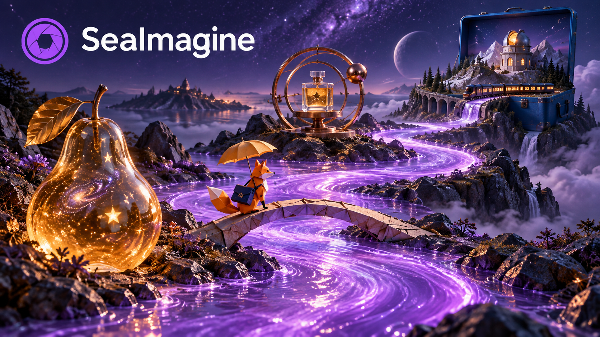](https://seaimagine.com/it/image-to-video/)

Vuoi creare la tua versione della pera di vetro o del mondo in valigia? Parti da un’immagine di riferimento in SeaImagine, incolla un prompt completo della raccolta e adatta soggetto, materiali e camera.

Non hai un’immagine iniziale adatta? Prepara la tua scena con la generazione di immagini IA. Se hai già un’immagine, passa direttamente da immagine a video. Scegli un tema della raccolta e adattalo mantenendo la sequenza temporale e i dettagli che non devono cambiare.

1. Scarica il fotogramma iniziale, caricalo nella funzione da immagine a video e incolla il prompt completo.
2. Scegli durata, proporzioni e risoluzione fra le opzioni del modello; genera prima una bozza.
3. Quando la composizione ti soddisfa, cambia un dettaglio alla volta e poi aumenta la risoluzione.

[Gemini Omni 1.1 Flash](https://seaimagine.com/it/model/gemini-omni-1-1-flash/) · [Gemini Omni](https://seaimagine.com/it/model/gemini-omni/)

[Immagine in video](https://seaimagine.com/it/image-to-video/) · [Testo in video](https://seaimagine.com/it/text-to-video/) · [Generatore di immagini IA](https://seaimagine.com/it/ai-image-generator/)

[Procedura SeaImagine](docs/seaimagine-workflow.md)

## Fonte e licenza

Adattato dal repository Flaq AI, con le sue raccolte e tre immagini di riferimento. Non tutto il contenuto è originale di SeaImagine. Guida indipendente, non ufficiale di Google.

[Flaq AI · awesome-gemini-omni-flash](https://github.com/flaqai/awesome-gemini-omni-flash) · [MIT](LICENSE) · [Contributing](CONTRIBUTING.md)
