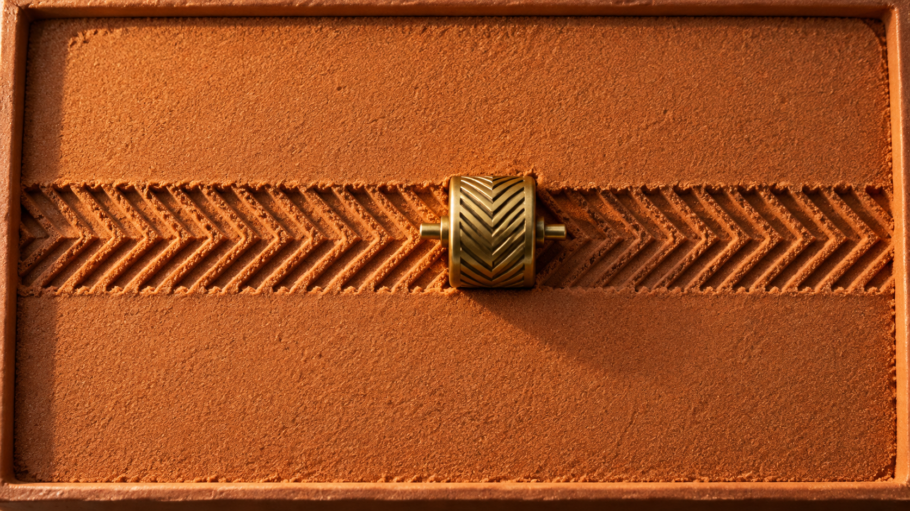
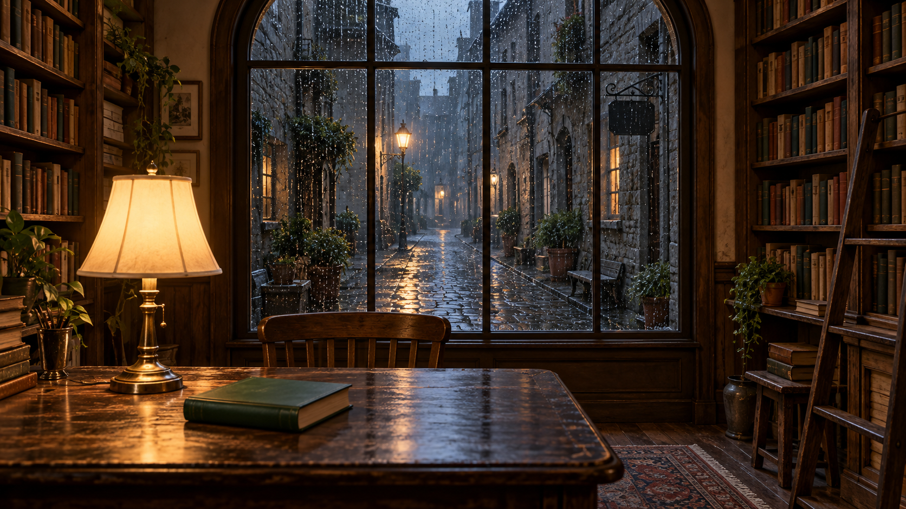
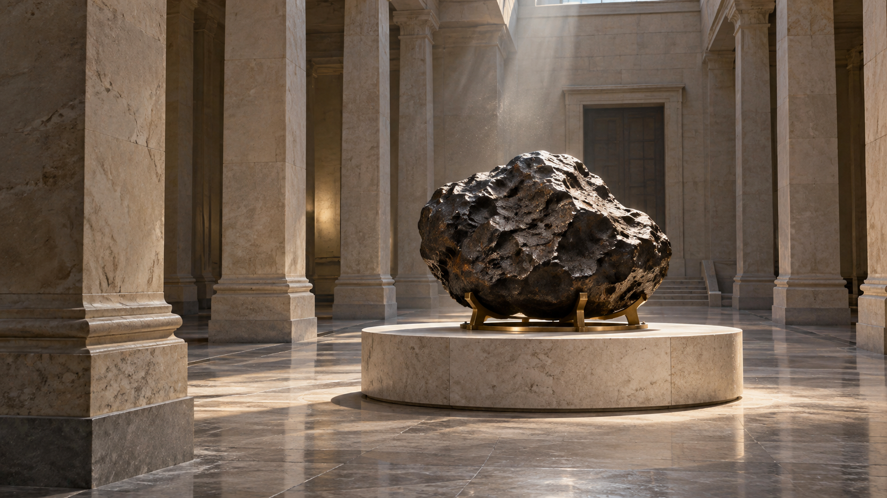
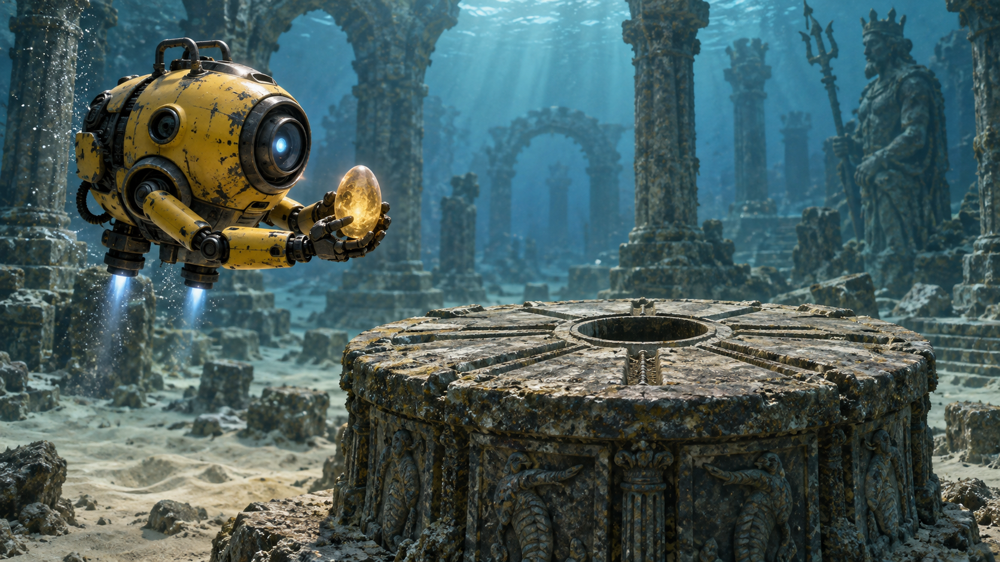

<div align="center">


# Gemini Omni 提示词库

**76 条完整提示词，分为 9 类；附 9 个原创首帧案例，以及配有作者公开提示词的效果展示。**

[English](README.md) · [简体中文](README_ZH.md) · [繁體中文](README_ZH-TW.md) · [日本語](README_JA.md) · [한국어](README_KO.md) · [Español](README_ES.md) · [Français](README_FR.md) · [Deutsch](README_DE.md) · [Português](README_PT.md) · [Italiano](README_IT.md)

[Русский](README_RU.md) · [Bahasa Indonesia](README_ID.md) · [ไทย](README_TH.md) · [Tiếng Việt](README_VI.md) · [العربية](README_AR.md)

[按分类浏览](#prompt-collections) · [九个可直接复制的案例](#source-examples) · [官方与社区效果展示](#video-studies) · [全部 76 条提示词索引](docs/prompt-index.md) · [下载全部提示词文本](prompts/copy/all-prompts.txt)

</div>

<a id="prompt-collections"></a>

## 按分类浏览

<table width="100%">
<tr>
<td width="33%" align="center" valign="top"><strong><a href="prompts/cinematic-storytelling.md">电影与叙事</a></strong><br><br><a href="prompts/cinematic-storytelling.md"></a><br>8 条提示词<br><a href="prompts/cinematic-storytelling.md#case-index">查看</a></td>
<td width="33%" align="center" valign="top"><strong><a href="prompts/commerce-social.md">商业广告与社交媒体</a></strong><br><br><a href="prompts/commerce-social.md"></a><br>8 条提示词<br><a href="prompts/commerce-social.md#case-index">查看</a></td>
<td width="33%" align="center" valign="top"><strong><a href="prompts/documentary-education.md">纪录片、旅行与教育</a></strong><br><br><a href="prompts/documentary-education.md"></a><br>8 条提示词<br><a href="prompts/documentary-education.md#case-index">查看</a></td>
</tr>
<tr>
<td width="33%" align="center" valign="top"><strong><a href="prompts/stylized-entertainment.md">动画、音乐与娱乐</a></strong><br><br><a href="prompts/stylized-entertainment.md"></a><br>8 条提示词<br><a href="prompts/stylized-entertainment.md#case-index">查看</a></td>
<td width="33%" align="center" valign="top"><strong><a href="prompts/control-editing-extension.md">多模态控制、编辑与续写</a></strong><br><br><a href="prompts/control-editing-extension.md"></a><br>10 条提示词<br><a href="prompts/control-editing-extension.md#case-index">查看</a></td>
<td width="33%" align="center" valign="top"><strong><a href="prompts/advanced-editing-camera.md">进阶编辑、镜头与视觉变换</a></strong><br><br><a href="prompts/advanced-editing-camera.md"></a><br>9 条提示词<br><a href="prompts/advanced-editing-camera.md#case-index">查看</a></td>
</tr>
<tr>
<td width="33%" align="center" valign="top"><strong><a href="prompts/storyboard-text-evaluation.md">故事板、文字与评测</a></strong><br><br><a href="prompts/storyboard-text-evaluation.md"></a><br>9 条提示词<br><a href="prompts/storyboard-text-evaluation.md#case-index">查看</a></td>
<td width="33%" align="center" valign="top"><strong><a href="prompts/tactile-asmr.md">触感与 ASMR（细微声音）</a></strong><br><br><a href="prompts/tactile-asmr.md"></a><br>8 条提示词<br><a href="prompts/tactile-asmr.md#case-index">查看</a></td>
<td width="33%" align="center" valign="top"><strong><a href="prompts/miniature-worlds.md">微缩与幻想世界</a></strong><br><br><a href="prompts/miniature-worlds.md"></a><br>8 条提示词<br><a href="prompts/miniature-worlds.md#case-index">查看</a></td>
</tr>
</table>

分类图用于展示题材；九个案例的配图为参考首帧。两者均不代表已生成的视频效果。

[全部 76 条提示词索引](docs/prompt-index.md) · [下载全部提示词文本](prompts/copy/all-prompts.txt) · [新增分类的创作灵感来源](docs/public-prompt-sources.md#category-inspiration)

分类说明目前以中文和英文编写，完整可复制提示词统一为英文。

<a id="source-examples"></a>

## 九个可直接复制的案例

参考图是输入素材，不是生成结果。

[01 · 雨夜洗衣房：重力失约](#example-01) · [02 · 琥珀香水：机械柑橘日蚀](#example-02) · [03 · 红树林：潜入荧光水域](#example-03) · [04 · 纸艺狐邮差：夜雨末班车](#example-04) · [05 · 琥珀玻璃梨：切开星形晶核](#example-05) · [06 · 蓝色旅行箱：云海天文台](#example-06) · [07 · 书店雨窗：只让窗外入冬](#example-07) · [08 · 陨石展厅：一镜环绕的视差](#example-08) · [09 · 水下遗迹：机器人归还光种](#example-09)

<a id="example-01"></a>

### 01 · 雨夜洗衣房：重力失约

[](assets/showcase-v2-01.png)

[电影与叙事](prompts/cinematic-storytelling.md) · [参考首帧](assets/showcase-v2-01.png) · [纯文本](prompts/copy/showcase-v2-01.txt)

```text
Use Image1 as the exact first frame of a 10-second, 16:9 cinematic shot. One adult repair technician in a yellow raincoat crouches beside one open cobalt-blue washing machine. A single red sock already floats just above the lower drum rim. Keep the washer, doorway and puddle layout fixed. Preserve the technician's appearance and the red sock's identity while allowing the specified movements.

[0-3s] Begin a slow, level camera push toward the open drum. The red sock rises another twenty centimetres and gently rotates. The technician notices it, steadies the small flashlight in her right hand, then looks from the sock to the puddle below. Her face shows curiosity rather than panic. Rain continues downward outside.
[3-7s] Gravity reverses only inside a cylinder extending vertically from the washer opening. A narrow stream lifts from the puddle directly beneath it into floating beads. The woman raises her empty left palm beneath the sock without touching it. Her raincoat, hair and tools remain normally weighted. Keep the washer firmly on the floor; do not rotate the room or the horizon.
[7-10s] The machine emits one soft relay click. The beads fall back into the original puddle; the sock drops neatly into her waiting left palm. Stop the camera movement as she gives the empty drum a small, incredulous glance.

Audio: continuous rain behind glass, a low motor winding down, individual water beads landing, then the relay click. No score or dialogue. Maintain a single continuous shot, natural hands, one sock and one technician. No extra laundry, text, logos, jump cuts or spontaneous object duplication. The final pose must visibly follow the catch.
```

<a id="example-02"></a>

### 02 · 琥珀香水：机械柑橘日蚀

[](assets/showcase-v2-02.png)

[商业广告与社交媒体](prompts/commerce-social.md) · [参考首帧](assets/showcase-v2-02.png) · [纯文本](prompts/copy/showcase-v2-02.txt)

```text
Animate Image1 into a 10-second, 16:9 product film in one continuous macro shot. The unlabelled square glass bottle contains amber perfume and remains upright on the same dark stone surface. Preserve the flat faces, straight edges, copper cap, fill level and bottle proportions. The copper gear ring moves behind it; one thin semicircular orange slice is fixed to the upper ring.

[0-3s] Move the camera slowly ten centimetres to the right while keeping the bottle dominant in the left half of the frame. A narrow amber light travels across the front glass, revealing fine condensation and the thickness of its base. The copper ring begins a steady clockwise turn around its visible pivot. The orange slice travels with that ring as one attached object, never independently.
[3-7s] The slice passes in front of the backlight, creating a partial eclipse. Its translucent pulp projects a moving citrus-coloured pattern through the bottle onto the stone surface. Keep the bottle stationary while the background mechanism creates the movement. Focus shifts briefly from the bottle's front edge to the illuminated pulp, then returns smoothly to the bottle.
[7-10s] The ring finishes a half revolution. The orange slice clears the light, revealing a clean bright crescent behind the upper-right bottle corner. Ease both camera and mechanism to a stop on a readable three-quarter product view with the bottle and mechanism both remaining visible.

Audio: one quiet copper bearing tick, a restrained original three-note plucked motif, and a soft mechanical stop. No pouring or fizzing sounds. No label, typography, brand mark, extra bottles, spraying perfume, melting glass, changing liquid level or cuts. The copper supports must remain physically attached and visible.
```

<a id="example-03"></a>

### 03 · 红树林：潜入荧光水域

[](assets/showcase-v2-03.png)

[纪录片、旅行与教育](prompts/documentary-education.md) · [参考首帧](assets/showcase-v2-03.png) · [纯文本](prompts/copy/showcase-v2-03.txt)

```text
Use Image1 as the starting frame for a 10-second, 16:9 natural-history-style visual study. This is an imaginative night scene, not a claim about a particular filmed species or location. Begin with the lens half above and half below calm mangrove water. Preserve the branching root geometry. The small silver fish begins at lower right and follows the path specified below. Sparse blue-green points are already visible near submerged roots.

[0-3s] Drift forward at a slow swimmer's pace. Above water, one leaf releases a droplet; the resulting ring spreads across the surface. Below water, suspended particles drift with the current. Keep a physically coherent waterline, with refraction and slight distortion separating the two views.
[3-6s] Lower the camera smoothly until the lens is fully submerged. Let the surface slide upward out of frame instead of dissolving between scenes. Follow the original silver fish as it turns left between two roots. A brief, localized trail of blue-green light responds to its wake and fades behind it; do not illuminate every root or particle.
[6-10s] Advance beneath the root arch and stop gently. The fish leaves through the left edge. Residual points fade to reveal amber silt and root textures in the low light. End looking back toward a narrow reflection of the night sky on the underside of the surface.

Audio: insects and distant water movement above the surface, transitioning continuously to muted underwater movement during submersion. No music, narration, dolphin calls or theatrical sonar. No people, added animals, coral, floating text, glowing plant outlines, abrupt lighting changes or cuts. Maintain plausible water movement and the same small fish throughout.
```

<a id="example-04"></a>

### 04 · 纸艺狐邮差：夜雨末班车

[](assets/showcase-v2-04.png)

[动画、音乐与娱乐](prompts/stylized-entertainment.md) · [参考首帧](assets/showcase-v2-04.png) · [纯文本](prompts/copy/showcase-v2-04.txt)

```text
Animate Image1 as a 10-second, 16:9 handmade paper stop-motion scene. An orange origami fox mail carrier stands at the left of a tiny railway platform under an ochre folded-paper umbrella, carrying an indigo paper satchel. One red folded-paper train approaches from the right background. Preserve every major fold, the fox's triangular muzzle, its two ears, the satchel strap and the station's paper construction.

[0-3s] The train rolls toward the platform in small, deliberate stop-motion increments. Fine suspended strands and tiny droplets suggest rain beyond the canopy; preserve the handmade set and folded-paper surfaces. Warm lanterns move slightly on thread-like supports. The fox turns its head toward the train while keeping the umbrella in the same paw.
[3-6s] The train stops with its nearest window aligned beside the fox. With its free paw, the fox extracts the single plain cream envelope already visible in the satchel front pocket. The pocket opens along its existing paper fold. Keep the envelope visibly separate from the paw and bag throughout.
[6-10s] The fox slides the envelope through the open train window onto a visible empty ledge; no passenger is needed. It withdraws its paw, gives one small bow and smooths the satchel pocket. Finish with the train still stopped and the cream envelope visible inside. Move the camera only in a slow, shallow push; do not cut.

Audio: miniature wheel clicks, a quiet brake squeak, dry paper rustles and soft rain-like pattering. No voices or recognizable tune. Use a gently stepped animation cadence, visible paper grain and warm practical lighting. No written addresses, station signs, logos, flesh, extra paws, transforming folds or realistic fur.
```

<a id="example-05"></a>

### 05 · 琥珀玻璃梨：切开星形晶核

[](assets/showcase-v2-05.png)

[触感与 ASMR（细微声音）](prompts/tactile-asmr.md) · [参考首帧](assets/showcase-v2-05.png) · [纯文本](prompts/copy/showcase-v2-05.txt)

```text
Use Image1 as the exact opening of a 10-second, 16:9 macro material study. A transparent amber glass pear stands upright on charcoal slate. An obsidian blade enters from the upper right and just touches the unbroken surface. Several small star-shaped inclusions are visible within the core. Treat the pear as a deliberately imaginary, sliceable glass material; it is not real fruit or a real cutting demonstration.

[0-3s] Hold the camera steady at the original low three-quarter angle. The blade presses downward through the near-right side at a slow, even speed. A fine luminous seam follows the cutting edge. The pear stays anchored by its own weight; its stem and silhouette remain unchanged. Keep the blade rigid and show its edge penetrating the material rather than passing through invisibly.
[3-7s] Complete one continuous cut that separates a single thin outer slice. The slice leans away and settles on the slate at the right, exposing a flat translucent cross-section. The existing star-shaped inclusions remain embedded in the larger standing piece, with their arrangement unchanged and clearer through the cut face. Preserve the removed slice's curved outer skin and matching flat inner face.
[7-10s] Withdraw the blade upward along its entry path. Rack focus gently from the resting slice to the largest central star-shaped inclusion. Amber caustics brighten beneath the cut face and settle. End with exactly two pear pieces, one whole stem and an unobstructed view of the central inclusion.

Audio: close dry glass-like ticks during penetration, one delicate chime as the slice meets slate, then quiet room tone. No music, chewing, wet flesh sounds or exaggerated shattering. No hands, blood, sparks, loose shards, extra cuts, regenerated pear sections, camera orbit or text.
```

<a id="example-06"></a>

### 06 · 蓝色旅行箱：云海天文台

[](assets/showcase-v2-06.png)

[微缩与幻想世界](prompts/miniature-worlds.md) · [参考首帧](assets/showcase-v2-06.png) · [纯文本](prompts/copy/showcase-v2-06.txt)

```text
Animate Image1 into a continuous 10-second, 16:9 miniature-diorama film. Inside an open blue hard-shell suitcase, a rocky mountain supports a brass-domed observatory above a shallow sea of clouds. One tiny steam locomotive with two carriages rests on a circular track around the mountain. A copper control knob sits on the front-right exterior panel. No hand is visible in the opening frame.

[0-2s] One adult hand enters from the near frame edge, reaches the copper knob on the front-right exterior panel, turns it one quarter-turn clockwise and releases it. The hand withdraws through the nearest frame edge without entering the miniature landscape. The suitcase, hinges, mountain and rails remain stationary. A tiny warm lamp beside the observatory door comes on.
[2-6s] The train starts gently and travels clockwise along the existing rails. Its three vehicles stay coupled, with wheels contacting the track. A narrow puff of steam rises from the locomotive and disperses above the carriage roofs. Slowly push the camera toward the mountain while keeping both suitcase rims visible to preserve the scale contrast.
[6-10s] The observatory dome rotates a small distance and its slit opens to reveal a short telescope aimed at one fixed star in the existing night sky. Clouds drift around the mountain base without spilling over the suitcase rim. Let the train continue behind the mountain, partially occluded rather than disappearing. Stop the camera with the glowing observatory above the cloud line.

Audio: close copper-knob click, miniature rail rhythm, soft gear movement and a restrained airy room ambience. No full-size train horn, narration or music. Preserve scale and object counts. No extra hands, flying rails, expanding suitcase, text, logos, time-lapse sky or cuts.
```

<a id="example-07"></a>

### 07 · 书店雨窗：只让窗外入冬

[](assets/showcase-v3-07.png)

[多模态控制、编辑与续写](prompts/control-editing-extension.md) · [参考首帧](assets/showcase-v3-07.png) · [纯文本](prompts/copy/showcase-v3-07.txt)

```text
Use Image1 as the exact first frame of a 10-second, 16:9 image-to-video scene. The camera looks from a warm empty bookshop through one large arched window onto a rainy cobbled lane. A reading table, a closed dark-green book and a brass lamp occupy the foreground. Only the exterior weather changes. No source video or additional reference is required.

[0-3s] Lock the camera at its starting position. Rain beads move down the outside of the glass while warm lamplight remains steady on the book and table. Establish the fixed border of the window: every weather change must remain beyond this border. Preserve the shelves, arch, table edges and lamp silhouette exactly.
[3-7s] Gradually replace the falling rain outside with sparse snowflakes. The existing lit streetlamps remain visible through the snowfall, with their positions and brightness unchanged. Thin snow collects first along the outer window ledge, then on the roof edges across the lane. Existing raindrops continue sliding down the glass rather than instantly vanishing. Keep the same lane, doorways and perspective throughout; no new buildings appear.
[7-10s] Let the snowfall settle into a gentle, continuous pattern. A narrow snow line remains on the exterior ledge. The indoor book, table and floor stay dry and warm, with no snow or frost crossing the glass. End on the same composition and furniture positions as the opening.

Audio: rain tapping the outer pane gradually gives way to muffled winter wind; the indoor room tone stays constant. No music, speech or page turning. No camera motion, time jump, interior relighting, additional objects, readable writing, people, cuts or full-frame seasonal dissolve.
```

<a id="example-08"></a>

### 08 · 陨石展厅：一镜环绕的视差

[](assets/showcase-v3-08.png)

[进阶编辑、镜头与视觉变换](prompts/advanced-editing-camera.md) · [参考首帧](assets/showcase-v3-08.png) · [纯文本](prompts/copy/showcase-v3-08.txt)

```text
Use Image1 as the exact opening of a 10-second, 16:9 architectural camera study. A single dark, deeply pitted meteorite rests on a low brass cradle atop a circular pale-stone pedestal. Tall rectangular stone columns surround the empty museum gallery. A narrow overhead shaft of daylight reveals dust in the air. There is no glass case and no moving exhibit.

[0-3s] Begin a slow clockwise orbit around the pedestal (clockwise in plan view, not an overhead shot), keeping the meteorite near frame centre. Maintain the initial camera height, lens focal length and distance from the pedestal. The foreground column shifts faster than the distant wall, establishing natural parallax. Do not rotate the meteorite to simulate camera movement.
[3-7s] Continue the same orbit through a total arc of approximately thirty degrees. Reveal the meteorite's previously hidden side while preserving its existing front contour and distinctive pits. The brass supports stay fixed beneath it. One nearer column briefly approaches the frame edge but never hides the central exhibit. Shadows and highlights change only as the viewpoint changes; the overhead light source remains stationary.
[7-10s] Ease the camera smoothly to a stop. Keep the full pedestal base in view and settle on a new three-quarter angle with a clear gap between the meteorite and the rear column. The background must finish at a visibly different perspective from the opening.

Audio: quiet ventilation and a distant low room resonance, with no footsteps, machinery or score. No cuts, zooms, focus pulsing, floating rock, rotating pedestal, extra exhibits, new surface markings, visitors, signs or captions. The entire effect comes from one controlled camera move around a motionless subject.
```

<a id="example-09"></a>

### 09 · 水下遗迹：机器人归还光种

[](assets/showcase-v3-09.png)

[故事板、文字与评测](prompts/storyboard-text-evaluation.md) · [参考首帧](assets/showcase-v3-09.png) · [纯文本](prompts/copy/showcase-v3-09.txt)

```text
Use Image1 as the exact first frame of a 10-second, 16:9 continuous underwater story. One compact yellow exploration robot hovers on the left, facing a waist-high circular stone socket on the right. Its two small articulated grippers already hold one translucent amber seed-shaped capsule. The socket is empty and dark. Broken stone arches, sand and suspended particles establish a quiet submerged ruin.

[0-3s] Follow the robot in a slow lateral tracking move as it approaches the socket. Its two downward thrusters lift a small cloud of sand that trails behind, never obscuring the capsule. Keep the robot's single round front lens, yellow housing, two arms and capsule shape consistent. The socket remains anchored to its original pedestal.
[3-7s] The robot stops, extends both arms together and lowers the capsule into the centre of the socket. Show contact before either gripper releases. The capsule settles upright; the grippers open and withdraw without passing through the stone. Only after the capsule is seated does a narrow amber glow begin spreading through existing carved channels in the pedestal.
[7-10s] The robot backs away a short distance and tilts its front lens toward the now-lit channels. Let the glow stop at the pedestal's outer rim rather than lighting the entire ruin. Fine sediment settles around its base. End with robot, capsule and complete pedestal visible in the same uninterrupted shot.

Audio: muted thruster vibration, a soft stone contact, then a restrained low resonant tone synchronized to the first glow. No voice, score or sonar ping. No extra robots, hands, duplicated capsules, instant-growing plants, collapsing ruins, text, cuts or unexplained flashes.
```

<a id="video-studies"></a>

## 官方与社区效果展示

每例均附原提示词链接。X 文本通过镜像核验，未验证原站播放；模型版本以各来源为准，这些效果并非本仓库复现。

<table width="100%">
<tr>
<td width="50%" valign="top"><strong>气泡雕塑</strong><br><a href="https://storage.googleapis.com/gweb-uniblog-publish-prod/original_videos/rt_wm__omni__keynote__orb-structural-foam__260517_1.mp4"></a><br>Google · Omni / Flash · 2026-05<br>需输入视频<br><strong>公开提示词摘录</strong><blockquote>Make the sculpture out of bubbles.</blockquote><a href="https://blog.google/innovation-and-ai/models-and-research/gemini-models/gemini-omni-3-5-videos/">作者公开提示词</a> · <a href="https://storage.googleapis.com/gweb-uniblog-publish-prod/original_videos/rt_wm__omni__keynote__orb-structural-foam__260517_1.mp4">观看视频</a> · <a href="https://blog.google/innovation-and-ai/models-and-research/gemini-models/gemini-omni-3-5-videos/">来源</a></td>
<td width="50%" valign="top"><strong>玻璃球里的递归房间</strong><br><a href="https://storage.googleapis.com/gweb-uniblog-publish-prod/original_videos/rt_wm_omni__keynote__sizzle__hand-infinite-orbs__260517_1.mp4"></a><br>Google · Omni / Flash · 2026-05<br>需输入视频<br><strong>公开提示词摘录</strong><blockquote>Put a black and white checkerboard room inside a glass sphere</blockquote><a href="https://blog.google/innovation-and-ai/models-and-research/gemini-models/gemini-omni-3-5-videos/">作者公开提示词</a> · <a href="https://storage.googleapis.com/gweb-uniblog-publish-prod/original_videos/rt_wm_omni__keynote__sizzle__hand-infinite-orbs__260517_1.mp4">观看视频</a> · <a href="https://blog.google/innovation-and-ai/models-and-research/gemini-models/gemini-omni-3-5-videos/">来源</a></td>
</tr>
<tr>
<td width="50%" valign="top"><strong>人物替换为火烈鸟</strong><br><a href="https://video.twimg.com/amplify_video/2056797343085969408/vid/avc1/1080x1440/UYr_7RKomiginRgq.mp4?tag=27"></a><br>CHRIS FIRST · Omni / Flash · 2026-05<br>需输入视频<br><strong>公开提示词摘录</strong><blockquote>Make everyone in this shot flamingos. Wearing the same outfit.</blockquote><a href="https://x.com/chrisfirst/status/2056797606509158681">作者公开提示词</a> · <a href="https://video.twimg.com/amplify_video/2056797343085969408/vid/avc1/1080x1440/UYr_7RKomiginRgq.mp4?tag=27">观看视频</a> · <a href="https://x.com/chrisfirst/status/2056797606509158681">来源</a></td>
<td width="50%" valign="top"><strong>每次拍手更换帽子</strong><br><a href="https://video.twimg.com/amplify_video/2056793760273686528/vid/avc1/720x1280/Q73liRfIjPtGSveL.mp4?tag=27"></a><br>Justine Moore · Omni / Flash · 2026-05<br>需输入视频<br><strong>公开提示词摘录</strong><blockquote>change my hat every time I clap.</blockquote><a href="https://x.com/venturetwins/status/2056793856843366789">作者公开提示词</a> · <a href="https://video.twimg.com/amplify_video/2056793760273686528/vid/avc1/720x1280/Q73liRfIjPtGSveL.mp4?tag=27">观看视频</a> · <a href="https://x.com/venturetwins/status/2056793856843366789">来源</a></td>
</tr>
<tr>
<td width="50%" valign="top"><strong>伦敦眼手持变焦</strong><br><a href="https://video.twimg.com/amplify_video/2056503814874861569/vid/avc1/1280x720/Lc2C4YtTflfGA8qe.mp4?tag=27"></a><br>fofr · Omni / Flash · 2026-05<br>文生视频<br><strong>公开提示词摘录</strong><blockquote>a recording from a capsule on the london eye, a jerky zoom into something in the distance</blockquote><a href="https://x.com/fofrAI/status/2056789242274259242">作者公开提示词</a> · <a href="https://video.twimg.com/amplify_video/2056503814874861569/vid/avc1/1280x720/Lc2C4YtTflfGA8qe.mp4?tag=27">观看视频</a> · <a href="https://x.com/fofrAI/status/2056789242274259242">来源</a></td>
<td width="50%" valign="top"><strong>触碰水壶后变换材质</strong><br><a href="https://video.twimg.com/amplify_video/2057176000459612161/vid/avc1/1280x720/LRzM8IueMomPMa7J.mp4?tag=27"></a><br>Alexander Chen · Omni / Flash · 2026-05<br>需输入视频<br><strong>公开提示词摘录</strong><blockquote>make the material of the pitcher instantly change (hard cuts) every 1 seconds to a new material</blockquote><a href="https://x.com/alexanderchen/status/2057176691903279524">作者公开提示词</a> · <a href="https://video.twimg.com/amplify_video/2057176000459612161/vid/avc1/1280x720/LRzM8IueMomPMa7J.mp4?tag=27">观看视频</a> · <a href="https://x.com/alexanderchen/status/2057176690519089166">来源</a></td>
</tr>
</table>

[来源 / FxTwitter](docs/public-prompt-sources.md)

## 进阶文档

熟悉基础用法后，可重点调整参考素材的角色、动作时序和单项变化。

1. 让提示词与首帧对应：物体数量、位置和初始状态应一致。
2. 每个时间段安排一个主要动作，让声音与画面中的触发点同步。
3. 保留主体，只改镜头或材质；按所选模型实际支持的时长调整时间段。

可直接复用的单项调整指令（所选模型需支持编辑）

```text
Change only the camera movement to a locked-off shot.
Keep the subject, material, action timing, lighting and audio unchanged.
Do not add objects, cuts or text.
```

[进阶文档](docs/guides/README_ZH.md)

[提示词设计](docs/prompting-guide.md) · [多语言指南](docs/multilingual-guide.md) · [参考素材与授权](docs/reference-videos.md)

<a id="brand-tools"></a>

## SeaImagine 创作入口

<a href="https://seaimagine.com/cn/"></a>

[](https://seaimagine.com/cn/image-to-video/)

想把玻璃梨切割、旅行箱世界变成自己的版本？可以在 SeaImagine 从参考图开始，粘贴本库的完整提示词，再按自己的想法调整主体、材质和镜头。

没有合适的首帧时，可先用 AI 图片生成准备自己的场景；已有图片则直接做图生视频。选取本库题材，保留动作时间线和需要保持不变的细节，即可开始改写。

1. 下载首帧，上传到图生视频入口，再粘贴完整提示词。
2. 按所选模型实际提供的选项设置时长、画幅和分辨率，先生成草稿。
3. 构图满意后，每次只调整一个细节，再提高分辨率。

[Gemini Omni 1.1 Flash](https://seaimagine.com/cn/model/gemini-omni-1-1-flash/) · [Gemini Omni](https://seaimagine.com/cn/model/gemini-omni/)

[图生视频](https://seaimagine.com/cn/image-to-video/) · [文生视频](https://seaimagine.com/cn/text-to-video/) · [AI 图片生成](https://seaimagine.com/cn/ai-image-generator/)

[SeaImagine 使用流程](docs/seaimagine-workflow.md)

## 来源与许可

本仓库改编自 Flaq AI 项目，沿用了提示词集合和 3 张参考图，并非全部由 SeaImagine 原创。本项目为独立指南，不是 Google 官方产品。

[Flaq AI · awesome-gemini-omni-flash](https://github.com/flaqai/awesome-gemini-omni-flash) · [MIT](LICENSE) · [Contributing](CONTRIBUTING.md)
