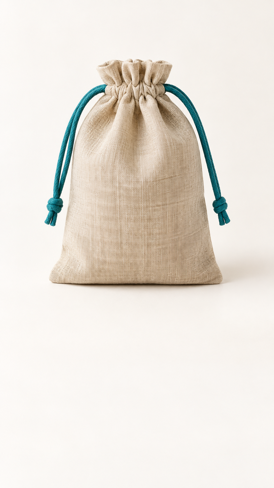

# Gemini Omni — Documentación avanzada

[Índice de los 60 prompts](../../README_ES.md)

## Qué encontrarás

La lista describe lo que puedes planificar con los prompts. Confirma las entradas, la edición, la extensión, el audio y la resolución disponibles para el modelo seleccionado en tu herramienta. Revisa primero la composición, el diálogo y el texto con una vista previa disponible. La API de Google (interfaz para programas) y la interfaz de tu herramienta son servicios distintos.

- Flujos de texto a video, imagen a video, fotograma inicial/final y referencias de sujetos.
- Diseño conjunto de imagen y audio: ambiente, foley, música original, silencios y diálogo.
- Guía de localización para 15 idiomas, con diálogo exacto, texto, RTL, longitud de línea y revisión nativa.
- Ediciones breves con `Keep everything else the same.` y extensiones coherentes.

## Diálogos en español

Puedes mantener las instrucciones de escena en inglés y fijar literalmente el diálogo y los textos en español. Revisa pronunciación, ortografía y tiempos.

```text
Spoken language: Spanish.
Exact dialogue at 6s, spoken once with natural conversational pacing: "Hoy volvamos por el camino largo."
Do not translate, paraphrase, repeat or subtitle the dialogue.

Exact on-screen Spanish title, centered from 7s to 10s: "PEQUEÑOS VIAJES"
Preserve accents and spelling exactly. No other text anywhere in the video.
```

## Cambiar solo el texto en pantalla

Si el modelo seleccionado permite editar video, pide únicamente el cambio necesario sobre la versión terminada. Este ejercicio modifica texto dentro de la imagen, no un archivo de subtítulos.

```text
Change only the final on-screen text to Spanish: "CALIDEZ EN CAMINO". Preserve its original position, size, material and timing. Keep everything else the same.
```

## Plantilla de 10 segundos

```text
Format: 9:16 vertical, 10 seconds.
Goal: [audience and intended response]
Scene: [place, time, weather, layout]
Subject: [3-5 stable identity anchors]
Subject motion: [ordered action]
Camera motion: [height, path, focus]
Environment motion: [wind, light, water, particles]
[0-3s] [hook]
[3-7s] [core action]
[7-10s] [payoff and final hold]
Audio: [foley, ambience, music, silence]
Exact dialogue in Spanish, spoken once: "[diálogo literal]"
Preserve: [identity, object, layout, audio]
Do not include: [short concrete list]
```

<a id="sea-practice"></a>

## Tres ejercicios de SeaImagine con imágenes originales

Estas imágenes de referencia se generaron con IA para practicar con el primer fotograma. No son resultados de vídeo probados con Gemini. Usa solo las funciones que aparezcan en SeaImagine.

### SEA-01 · Una mañana con una taza de cerámica verde azulada

[](../../assets/seaimagine-ceramic-cup.png)

Acerca la cámara despacio sin alterar el asa, el borde ni el nivel del líquido. Deja espacio para un texto final.

Sube la imagen de la taza para animarla. Prueba solo un acercamiento lento y revisa el asa y el líquido antes de añadir el texto.

[Imagen a vídeo](https://seaimagine.com/es/image-to-video/) · [Generador de imágenes con IA](https://seaimagine.com/es/ai-image-generator/)

```text
Use the uploaded ceramic-cup image as the exact first frame. Create a 10-second, 16:9 product shot.
Preserve the teal glaze, the single handle on the right, the rim shape, the coffee level and the cup's position on the wooden table.
[0-3s] A thin ribbon of steam rises; the camera begins a very slow forward move.
[3-7s] Warm morning light grazes the glaze. Keep the table and background still; only steam and gentle reflections move.
[7-10s] The camera eases to a stop. Hold the same product with clean space above for a caption added later.
Audio, if supported: quiet room ambience and one distant bird. No speech or music.
No pouring, added cup, new handle, object morphing, generated text, logo or watermark.
```

### SEA-02 · Luces en un puerto de papel

[](../../assets/seaimagine-paper-harbor.png)

En una sola toma, enciende el faro y aumenta por turnos la luz de las ventanas de las tres casas. Conserva la textura del papel y la geometría.

Sube la imagen del puerto y pide encender el faro e intensificar las luces de las ventanas en secuencia. Compara la forma de los edificios al principio y al final.

[Imagen a vídeo](https://seaimagine.com/es/image-to-video/) · [Generador de imágenes con IA](https://seaimagine.com/es/ai-image-generator/)

```text
Use the uploaded paper-harbor image as the exact first frame. Animate a single 10-second, 16:9 shot while retaining the handcrafted paper texture, folds and miniature scale.
Keep the ivory lighthouse with its red roof, the three small houses on the left and the single paper boat in exactly the same positions.
[0-3s] The lighthouse window slowly glows warm amber. The camera begins a small, straight forward move.
[3-7s] The already warm house windows brighten gently one house at a time, from nearest to farthest. No building moves or changes shape.
[7-10s] The camera stops. Hold the warm windows against the blue-hour paper harbor. Keep the boat and miniature water surface still.
Audio, if supported: a quiet original celesta phrase, no voices.
No ocean waves, added buildings, extra boats, rotating tower, camera cut, text, logo or watermark.
```

### SEA-03 · Una bolsa de lino para una tienda multilingüe

<a href="../../assets/seaimagine-linen-pouch.png"></a>

Crea un vídeo vertical limpio, sin letras, y añade los subtítulos en cada idioma con un editor de vídeo convencional.

Anima la imagen de la bolsa en formato vertical y añade después los subtítulos traducidos. Usa una instrucción breve de edición de vídeo solo si esa función está disponible.

[Imagen a vídeo](https://seaimagine.com/es/image-to-video/) · [Generador de imágenes con IA](https://seaimagine.com/es/ai-image-generator/)

```text
Use the uploaded linen-pouch photograph as the exact first frame. Create a 10-second, 9:16 vertical ecommerce product shot.
Keep one natural-linen drawstring pouch upright in the same position. Preserve its seam placement, woven texture, silhouette and teal drawstring.
[0-3s] Start on the supplied framing. The camera slowly moves forward without orbiting.
[3-7s] A soft highlight travels gently across the fabric; the pouch and its string do not move.
[7-10s] Stop the camera and hold the product. Keep the lower quarter of the frame empty, evenly lit and free of objects for a caption added in editing.
Audio, if supported: soft room tone. No speech or music.
Do not generate any lettering, subtitles, symbols, price, logo, watermark, extra bag or moving string.
```

> Un día a día más sencillo
