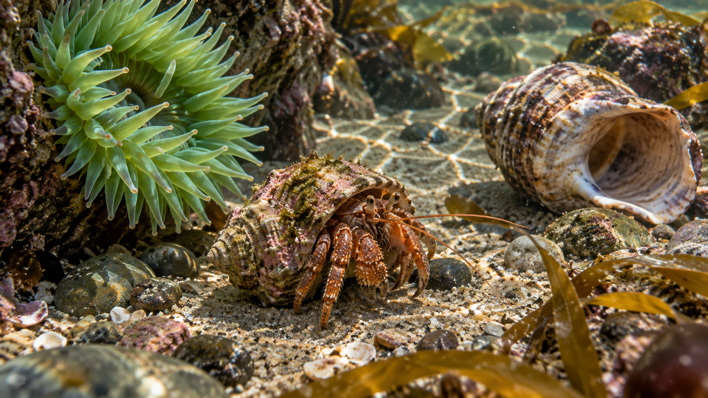

# 纪录片、旅行与教育：8 个原创提示词

<!-- catalog:hero:start -->
[](../assets/category-documentary-v3.png)

*分类题材示意 / Category illustration*
<!-- catalog:hero:end -->

[← 上一篇：商业广告与社交媒体](commerce-social.md) · [返回中文主页](../README_ZH.md) · [English home](../README.md) · 下一篇：[动画、音乐与娱乐 →](stylized-entertainment.md)

> Source: adapted from [Flaq AI](https://github.com/flaqai/awesome-gemini-omni-flash), under MIT. Prompts are practice briefs, not SeaImagine-verified results. Advanced controls depend on the selected interface.

Omni 的世界知识适合帮助建立可信场景，但提示词不能代替事实核查。涉及历史、科学、医疗或公共安全时，应由领域专家复核画面和解说。

<a id="case-index"></a>

<!-- catalog:toc:start -->
**本页案例 / Cases** · [全部 76 例 / All 76 cases](../docs/prompt-index.md)

- [01 · 火山脊骑行纪录片](#case-01) · [TXT](copy/documentary-education-01.txt)
- [02 · 玄武岩柱是怎样形成的](#case-02) · [TXT](copy/documentary-education-02.txt)
- [03 · 潮池的十秒微型世界](#case-03) · [TXT](copy/documentary-education-03.txt)
- [04 · 古代港口的证据式重建](#case-04) · [TXT](copy/documentary-education-04.txt)
- [05 · 光合作用：从光子到糖](#case-05) · [TXT](copy/documentary-education-05.txt)
- [06 · 博物馆器物的三层观察](#case-06) · [TXT](copy/documentary-education-06.txt)
- [07 · 四语发音：同一概念，不同节奏](#case-07) · [TXT](copy/documentary-education-07.txt)
- [08 · 被动式住宅：建筑微纪录片](#case-08) · [TXT](copy/documentary-education-08.txt)
<!-- catalog:toc:end -->

<a id="case-01"></a>

## 01｜火山脊骑行纪录片

<!-- catalog:copy:start -->
[复制全文 / Download TXT](copy/documentary-education-01.txt) · [本页索引 / Case index](#case-index)
<!-- catalog:copy:end -->

**模式：** 首帧图生视频 · **素材：** [源库参考首帧](../assets/travel-cyclist.png) · **画幅：** 16:9

```text
[# Sources <FIRST_FRAME>@Image1]
Animate Image1 as a single continuous 10-second documentary tracking shot. Use it as the exact first frame.

The cyclist pedals steadily toward the distant observatory while the camera follows from the same height, drifting forward only slightly. Silver grass bends in two distinct wind gusts, loose gravel reacts under the rear tire, and clouds move slowly below the ridge. At 6s, the first warm sunlight reaches the cyclist's jacket and the observatory dome. Preserve the geography and realistic bicycle motion.

Sound design: close tire crunch and chain movement, strong ridge wind with natural stereo width, one distant bird at 7s. No music, no narration.
No cuts, no drone rise, no extra cyclists, no landmark text, no logo, no watermark.
```

<a id="case-02"></a>

## 02｜玄武岩柱是怎样形成的

<!-- catalog:copy:start -->
[复制全文 / Download TXT](copy/documentary-education-02.txt) · [本页索引 / Case index](#case-index)
<!-- catalog:copy:end -->

**模式：** 文生科普视频 · **画幅：** 16:9 · **重点：** 地质过程、时间压缩、标签

```text
Create a 10-second museum-quality geological explainer showing how columnar basalt forms. Use a clean cutaway of one cooling lava flow; visually distinguish the hot interior, cooling surface and contraction joints.

[0-3s] Side cutaway: dark crust forms on a glowing basaltic lava body. A small exact label appears with a thin leader line: "COOLING SURFACE".
[3-7s] Time compresses. Heat fades from orange to dark red; polygonal cracks begin at the surface and propagate inward perpendicular to it. The camera slowly moves closer to the crack front.
[7-10s] Pull back to reveal organized stone columns after cooling. Replace the first label with exact text: "CONTRACTION JOINTS". Keep it readable.

Style: physically grounded scientific visualization, realistic rock texture, restrained color scale, no fantasy crystals.
Audio: low lava movement, subtle cooling ticks, neutral original pulse. Calm English narration: "As lava cools and contracts, fractures organize into columns." Speak once; no subtitles.
No inaccurate eruption, no people, no extra labels, no logo or watermark.
```

<a id="case-03"></a>

## 03｜潮池的十秒微型世界

<!-- catalog:copy:start -->
[复制全文 / Download TXT](copy/documentary-education-03.txt) · [本页索引 / Case index](#case-index)
<!-- catalog:copy:end -->

**模式：** 文生自然纪录片 · **画幅：** 16:9 · **重点：** 微距生态、自然环境声

```text
Create a natural-history macro sequence inside a temperate coastal tide pool at low tide, 10 seconds.

[0-4s] One continuous underwater macro push past swaying green anemone tentacles toward a small hermit crab. Suspended particles move with a gentle surge; sunlight caustics match the water surface.
[4-7s] The crab tests a larger empty shell with both claws, rotates it, then transfers into it with anatomically plausible movement. Do not anthropomorphize.
[7-10s] A wave refills the pool, briefly lifting kelp and sand; the crab anchors behind a rock. Camera stays submerged and stable.

Audio: muffled wave energy, pebble movement, water surge; no music, no narration.
Look: field-documentary realism, true-to-life scale and color, no studio aquarium glass.
No tropical species, no impossible animal behavior, no plastic, no text, logo or watermark.
```

<a id="case-04"></a>

## 04｜古代港口的证据式重建

<!-- catalog:copy:start -->
[复制全文 / Download TXT](copy/documentary-education-04.txt) · [本页索引 / Case index](#case-index)
<!-- catalog:copy:end -->

**模式：** 文生历史重建 · **画幅：** 16:9 · **重点：** 将确定与推测分开

```text
Create a 10-second educational reconstruction of a fictional first-century Mediterranean trading quay. Present it as a careful visualization, not a claim about one exact archaeological site.

[0-4s] Ground-level view follows workers rolling amphorae on a simple wooden dolly beside a stone quay. A square-sailed merchant vessel is moored with plausible ropes; clothing and tools are functional and worn.
[4-7s] Camera rises to show warehouse doors, weighing scales and cargo categories. Small neutral overlay in the lower corner reads exactly: "EVIDENCE-BASED RECONSTRUCTION".
[7-10s] Transition half the frame into a restrained line-drawing layer that reveals which structures are reconstructed beyond surviving foundations. Exact legend: "SURVIVING" and "INFERRED" with two simple swatches.

Audio: harbor water, rope tension, wood, distant workers with indistinct speech. No modern score, no clear dialogue.
No famous monument, no empire flags, no modern cranes, no anachronistic weapons, no other text, logo or watermark.
```

<a id="case-05"></a>

## 05｜光合作用：从光子到糖

<!-- catalog:copy:start -->
[复制全文 / Download TXT](copy/documentary-education-05.txt) · [本页索引 / Case index](#case-index)
<!-- catalog:copy:end -->

**模式：** 文生科学可视化 · **画幅：** 16:9 · **重点：** 抽象过程、可读标签

```text
Create a clear 10-second classroom animation explaining the high-level flow of photosynthesis without implying literal molecular scale or exact reaction geometry.

[0-3s] A leaf cross-section appears on a clean dark-green field. Sunlight particles enter the chloroplast. Exact labels: "LIGHT" and "CHLOROPLAST".
[3-7s] Camera moves into a stylized chloroplast. Water and carbon dioxide inputs travel along separate paths into a simplified energy-conversion hub. Exact labels: "H₂O" and "CO₂". Oxygen exits visibly as "O₂".
[7-10s] Pull back to the whole plant as a glowing path indicates stored chemical energy. Final exact text: "LIGHT ENERGY → CHEMICAL ENERGY".

Style: elegant 2.5D scientific motion graphics, consistent visual grammar, high contrast, readable labels.
Audio: light electronic pulses matched to each stage. English narration: "Plants use light to store energy, releasing oxygen along the way." Speak once.
No extra equations, no talking plant, no DNA helix, no inaccurate organelles, no logo or watermark.
```

<a id="case-06"></a>

## 06｜博物馆器物的三层观察

<!-- catalog:copy:start -->
[复制全文 / Download TXT](copy/documentary-education-06.txt) · [本页索引 / Case index](#case-index)
<!-- catalog:copy:end -->

**模式：** 图片参考 · **画幅：** 9:16 · **输入：** Image1 为已获授权的器物照片

```text
[# References <IMAGE_REF_0>@Image1]
Create a 9:16, 10-second museum interpretation video using Image1 only as the exact artifact reference. Place the artifact in a neutral conservation studio; do not invent inscriptions or missing parts.

[0-3s] Slow 40-degree orbit around the artifact with a small scale bar visible but no numeric claim. Raking light reveals surface wear.
[3-6s] Freeze the orbit and use a subtle transparent highlight to indicate three manufacturing marks. Exact heading: "HOW IT WAS MADE". No other labels.
[6-10s] Return to the unaltered object. Light shifts to reveal repaired areas without changing them. Exact final question: "WHAT CAN WE KNOW?"

Audio: quiet gallery room tone, soft turntable motor, one restrained tonal bed. Calm narration in Japanese: "痕跡は、作り方と使われ方を伝えます。" Speak once, no subtitles.
Preserve the artifact's geometry, color, damage and patina. No hands, fantasy restoration, invented provenance, logo or watermark.
```

<a id="case-07"></a>

## 07｜四语发音：同一概念，不同节奏

<!-- catalog:copy:start -->
[复制全文 / Download TXT](copy/documentary-education-07.txt) · [本页索引 / Case index](#case-index)
<!-- catalog:copy:end -->

**模式：** 文生语言教学 · **画幅：** 16:9 · **重点：** 多语言、文字与音频同步

```text
Create a 10-second minimalist language-learning video for the idea "Take your time." Use four equal visual beats on a warm off-white background, with a simple animated walking dot. Only one language appears and is spoken at a time.

[0-2.5s] Exact text: "Take your time." Natural English voice speaks it once.
[2.5-5s] Exact text: "慢慢来。" Natural Mandarin Chinese voice speaks it once: "慢慢来。"
[5-7.5s] Exact text: "ゆっくりでいいよ。" Natural Japanese voice speaks it once.
[7.5-10s] Exact text: "Tómate tu tiempo." Natural Spanish voice speaks it once.

The walking dot changes pace subtly to match each phrase but never stops. Use the same type size and placement for all languages. Insert a clean half-second silence between voices. No background music.
Preserve accents, punctuation and Japanese/Chinese characters exactly. Do not translate aloud, overlap voices, add flags, phonetics, subtitles, logo or watermark.
```

<a id="case-08"></a>

## 08｜被动式住宅：建筑微纪录片

<!-- catalog:copy:start -->
[复制全文 / Download TXT](copy/documentary-education-08.txt) · [本页索引 / Case index](#case-index)
<!-- catalog:copy:end -->

**模式：** 文生建筑解释 · **画幅：** 16:9 · **重点：** 空间连贯、信息叠加

```text
Create a 10-second architectural mini-documentary of a fictional compact passive house in a cold climate.

[0-3s] Winter exterior at sunrise. Camera approaches the simple timber facade while snow remains undisturbed around it. Exact small heading: "KEEP HEAT IN".
[3-7s] Seamless sectional transition through the wall reveals thick insulation, triple glazing and an airtight layer as three visually distinct bands. Warm interior air stays inside; cold airflow moves around the exterior. Do not show heat as flames.
[7-10s] Continue into the occupied living space: one adult reads near the window comfortably while snow falls outside. Exact final text: "LESS ENERGY. STEADY COMFORT."

Audio: winter wind outside crossfades to quiet interior room tone and a low ventilation system. Calm English narration: "Good envelopes reduce heat loss before technology adds heat." No subtitles.
No brand systems, no impossible transparent walls after the section ends, no luxury excess, no logo or watermark.
```

## 事实与安全检查

1. 将提示词中的每一个事实性断言列出来，并找到可靠来源核对。
2. 把“已知”“推断”“示意”在画面语言上区分开。
3. 不要让视觉隐喻伪装成精确比例、因果或实验结果。
4. 需要数值、日期、地图边界或健康建议时，先由专家确认再渲染。
5. 使用真实文物、场所或人物素材前确认授权和文化敏感性。
